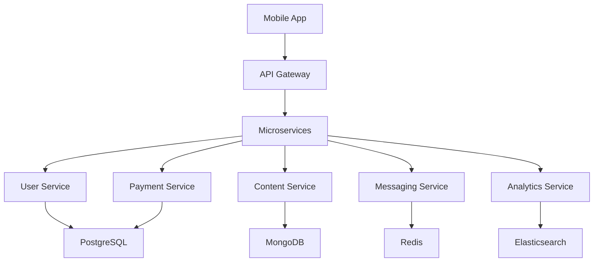
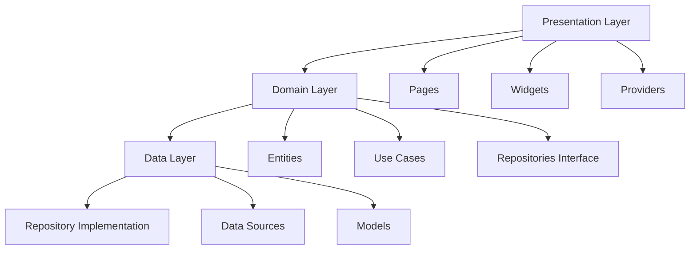

# 🏗️ Enterprise Mobile App Architecture

> Kiến trúc ứng dụng mobile có khả năng mở rộng cho hàng triệu người dùng, được thiết kế dựa trên best practices từ Instagram, Uber, Netflix và TikTok.

[](https://flutter.dev/)
[](https://dart.dev/)
[](LICENSE)

## 📋 Mục lục

- 🎯 Tổng quan
- 🏛️ Kiến trúc
- 📦 Tech Stack
- 🚀 Quick Start
- 📁 Cấu trúc dự án
- 🔧 Implementation Guide
- 🧪 Testing Strategy
- 📊 Performance & Monitoring
- 🚢 Deployment
- 📚 Best Practices

## 🎯 Tổng quan

### Đặc điểm chính

- ✅ **Scalable**: Hỗ trợ hàng triệu người dùng
- ✅ **Modular**: Feature-based architecture
- ✅ **Testable**: Comprehensive testing strategy
- ✅ **Performance**: Multi-layer caching & optimization
- ✅ **Maintainable**: Clean architecture principles
- ✅ **Real-time**: WebSocket & gRPC support

### Phù hợp cho

- 📱 Ứng dụng có **hàng triệu người dùng**
- 👥 **Team lớn** (10+ developers)
- 🔄 **Real-time features** (chat, notifications)
- 💰 **Complex business logic** (e-commerce, fintech)
- 🌍 **Multi-platform** (iOS, Android, Web)

## 🏛️ Kiến trúc

### High-level Architecture



### Mobile App Architecture



## 📦 Tech Stack

### Core Framework
```yaml
Flutter: ^3.32.0
Dart SDK: ^3.8.0
```

### State Management & DI
```yaml
flutter_riverpod: ^2.3.4      # State management
get_it: ^8.0.0                # Dependency injection
injectable: ^2.5.0            # DI code generation
```

### Network & Communication
```yaml
dio: ^5.7.0                   # HTTP client
web_socket_channel: ^3.0.0    # WebSocket
grpc: ^3.2.4                  # gRPC protocol
```

### Local Storage
```yaml
hive_flutter: ^1.1.0          # NoSQL database
sqlite3_flutter_libs: ^0.5.0  # SQL database
flutter_secure_storage: ^9.2.0 # Secure storage
```

### Performance & Caching
```yaml
cached_network_image: ^3.2.2
flutter_cache_manager: ^3.3.1
```

### Monitoring & Analytics
```yaml
firebase_analytics: ^11.3.0
firebase_crashlytics: ^4.0.0
sentry_flutter: ^8.9.0
```

## 🚀 Quick Start

### 1. Prerequisites

```bash
# Flutter SDK
flutter --version
# Should be >= 3.32.0

# Dart SDK  
dart --version
# Should be >= 3.8.0

# Tools
dart pub global activate melos
dart pub global activate build_runner
```

### 2. Clone & Setup

```bash
# Clone repository
git clone https://github.com/your-org/enterprise-mobile-app.git
cd enterprise-mobile-app

# Setup workspace
melos bootstrap

# Generate code
melos run build_runner

# Run app
cd app
flutter run
```

### 3. Environment Setup

```bash
# Copy environment files
cp .env.example .env.development
cp .env.example .env.staging  
cp .env.example .env.production

# Edit environment variables
# API_BASE_URL, DATABASE_URL, etc.
```

## 📁 Cấu trúc dự án

```
enterprise_mobile_app/
├── 📦 packages/                    # Shared packages
│   ├── 🔧 core/                   # Core business logic
│   │   ├── lib/
│   │   │   ├── src/
│   │   │   │   ├── network/       # API clients
│   │   │   │   ├── storage/       # Database layer
│   │   │   │   ├── auth/          # Authentication
│   │   │   │   ├── analytics/     # Analytics wrapper
│   │   │   │   ├── logging/       # Logging system
│   │   │   │   ├── error/         # Error handling
│   │   │   │   └── utils/         # Utilities
│   │   │   └── core.dart
│   │   ├── test/
│   │   └── pubspec.yaml
│   │
│   ├── 🎨 design_system/          # UI Design System
│   │   ├── lib/
│   │   │   ├── src/
│   │   │   │   ├── tokens/        # Design tokens
│   │   │   │   ├── components/    # Reusable widgets
│   │   │   │   ├── themes/        # App themes
│   │   │   │   └── icons/         # Custom icons
│   │   │   └── design_system.dart
│   │   └── pubspec.yaml
│   │
│   └── 🚀 features/               # Feature modules
│       ├── user_management/
│       │   ├── lib/
│       │   │   ├── src/
│       │   │   │   ├── data/
│       │   │   │   │   ├── repositories/
│       │   │   │   │   ├── datasources/
│       │   │   │   │   └── models/
│       │   │   │   ├── domain/
│       │   │   │   │   ├── entities/
│       │   │   │   │   ├── repositories/
│       │   │   │   │   └── usecases/
│       │   │   │   └── presentation/
│       │   │   │       ├── pages/
│       │   │   │       ├── widgets/
│       │   │   │       └── providers/
│       │   │   └── user_management.dart
│       │   ├── test/
│       │   └── pubspec.yaml
│       │
│       ├── content_feed/
│       ├── messaging/
│       ├── notifications/
│       └── payments/
│
├── 📱 app/                        # Main application
│   ├── lib/
│   │   ├── main.dart
│   │   ├── app/
│   │   │   ├── app.dart
│   │   │   ├── app_config.dart
│   │   │   └── app_router.dart
│   │   ├── di/
│   │   │   ├── injection.dart
│   │   │   └── injection.config.dart
│   │   └── features/
│   ├── android/
│   ├── ios/
│   ├── test/
│   ├── integration_test/
│   └── pubspec.yaml
│
├── 🧪 tools/                      # Development tools
│   ├── build_scripts/
│   ├── ci_cd/
│   └── code_generation/
│
├── 📚 docs/                       # Documentation
│   ├── architecture/
│   ├── api/
│   └── deployment/
│
├── melos.yaml                     # Workspace configuration
├── analysis_options.yaml         # Dart analyzer rules
└── README.md
```

## 🔧 Implementation Guide

### 1. Setup Workspace (melos.yaml)

```yaml
name: enterprise_mobile_app

packages:
  - packages/**
  - app

command:
  version:
    workspaceChangelog: true

scripts:
  analyze:
    run: dart analyze --fatal-infos
    exec:
      concurrency: 1

  test:
    run: flutter test
    exec:
      concurrency: 1

  build_runner:
    run: dart run build_runner build --delete-conflicting-outputs
    exec:
      concurrency: 1

  clean:
    run: flutter clean
    exec:
      concurrency: 1

  get:
    run: flutter pub get
    exec:
      concurrency: 1

dev_dependencies:
  melos: ^6.1.0
```

### 2. Core Package Implementation

#### Network Layer

```dart
import 'package:dio/dio.dart';
import 'package:injectable/injectable.dart';

@singleton
class ApiClient {
  late final Dio _dio;
  final String baseUrl;

  ApiClient({required this.baseUrl}) {
    _dio = Dio(BaseOptions(
      baseUrl: baseUrl,
      connectTimeout: const Duration(seconds: 30),
      receiveTimeout: const Duration(seconds: 30),
      headers: {
        'Content-Type': 'application/json',
        'Accept': 'application/json',
      },
    ));

    _setupInterceptors();
  }

  void _setupInterceptors() {
    // Auth interceptor
    _dio.interceptors.add(AuthInterceptor());
    
    // Retry interceptor
    _dio.interceptors.add(RetryInterceptor(
      dio: _dio,
      retries: 3,
      retryDelays: const [
        Duration(seconds: 1),
        Duration(seconds: 2),
        Duration(seconds: 3),
      ],
    ));

    // Cache interceptor
    _dio.interceptors.add(CacheInterceptor());
    
    // Logging (debug only)
    if (kDebugMode) {
      _dio.interceptors.add(LogInterceptor(
        requestBody: true,
        responseBody: true,
        requestHeader: true,
        responseHeader: false,
      ));
    }
  }

  Future<T> get<T>(
    String path, {
    Map<String, dynamic>? queryParameters,
    Options? options,
  }) async {
    try {
      final response = await _dio.get<T>(
        path,
        queryParameters: queryParameters,
        options: options,
      );
      return response.data!;
    } on DioException catch (e) {
      throw NetworkException.fromDioError(e);
    }
  }

  Future<T> post<T>(
    String path, {
    dynamic data,
    Map<String, dynamic>? queryParameters,
    Options? options,
  }) async {
    try {
      final response = await _dio.post<T>(
        path,
        data: data,
        queryParameters: queryParameters,
        options: options,
      );
      return response.data!;
    } on DioException catch (e) {
      throw NetworkException.fromDioError(e);
    }
  }

  // PUT, DELETE methods...
}
```

#### Auth Interceptor

```dart
@injectable
class AuthInterceptor extends Interceptor {
  final AuthRepository _authRepository;

  AuthInterceptor(this._authRepository);

  @override
  void onRequest(
    RequestOptions options,
    RequestInterceptorHandler handler,
  ) async {
    final token = await _authRepository.getAccessToken();
    if (token != null) {
      options.headers['Authorization'] = 'Bearer $token';
    }
    handler.next(options);
  }

  @override
  void onError(DioException err, ErrorInterceptorHandler handler) async {
    if (err.response?.statusCode == 401) {
      // Try to refresh token
      final refreshed = await _authRepository.refreshToken();
      if (refreshed) {
        // Retry original request
        final token = await _authRepository.getAccessToken();
        err.requestOptions.headers['Authorization'] = 'Bearer $token';
        
        final response = await Dio().fetch(err.requestOptions);
        return handler.resolve(response);
      } else {
        // Logout user
        await _authRepository.logout();
      }
    }
    handler.next(err);
  }
}
```

#### Cache Manager

```dart
@singleton
class CacheManager {
  final Map<String, CacheEntry> _memoryCache = {};
  final Box _diskCache;
  final Duration _defaultTtl;

  CacheManager(this._diskCache, {this._defaultTtl = const Duration(hours: 1)});

  Future<T?> get<T>(String key, {Duration? ttl}) async {
    // L1: Memory cache
    final memoryEntry = _memoryCache[key];
    if (memoryEntry != null && !memoryEntry.isExpired) {
      return memoryEntry.data as T;
    }

    // L2: Disk cache
    final diskData = await _diskCache.get(key);
    if (diskData != null) {
      final entry = CacheEntry.fromMap(diskData);
      if (!entry.isExpired) {
        // Promote to memory cache
        _memoryCache[key] = entry;
        return entry.data as T;
      } else {
        // Remove expired entry
        await _diskCache.delete(key);
      }
    }

    return null;
  }

  Future<void> set<T>(String key, T data, {Duration? ttl}) async {
    final entry = CacheEntry(
      data: data,
      expiresAt: DateTime.now().add(ttl ?? _defaultTtl),
    );

    // Store in both layers
    _memoryCache[key] = entry;
    await _diskCache.put(key, entry.toMap());
  }

  Future<void> remove(String key) async {
    _memoryCache.remove(key);
    await _diskCache.delete(key);
  }

  Future<void> clear() async {
    _memoryCache.clear();
    await _diskCache.clear();
  }
}

class CacheEntry {
  final dynamic data;
  final DateTime expiresAt;

  CacheEntry({required this.data, required this.expiresAt});

  bool get isExpired => DateTime.now().isAfter(expiresAt);

  Map<String, dynamic> toMap() => {
    'data': data,
    'expires_at': expiresAt.toIso8601String(),
  };

  factory CacheEntry.fromMap(Map<String, dynamic> map) => CacheEntry(
    data: map['data'],
    expiresAt: DateTime.parse(map['expires_at']),
  );
}
```

### 3. Feature Implementation Example

#### User Management Feature

```dart
import 'package:freezed_annotation/freezed_annotation.dart';

part 'user.freezed.dart';

@freezed
class User with _$User {
  const factory User({
    required String id,
    required String email,
    required String username,
    String? firstName,
    String? lastName,
    String? avatarUrl,
    @Default(false) bool isVerified,
    required DateTime createdAt,
    DateTime? updatedAt,
  }) = _User;

  const User._();

  String get displayName {
    if (firstName != null && lastName != null) {
      return '$firstName $lastName';
    }
    return username;
  }

  String get initials {
    if (firstName != null && lastName != null) {
      return '${firstName![0]}${lastName![0]}'.toUpperCase();
    }
    return username.substring(0, 2).toUpperCase();
  }
}
```

```dart
import 'package:dartz/dartz.dart';
import '../entities/user.dart';
import '../../../../core/lib/src/error/failures.dart';

abstract class UserRepository {
  Future<Either<Failure, User>> getCurrentUser();
  Future<Either<Failure, User>> getUserById(String id);
  Future<Either<Failure, User>> updateUser(String id, Map<String, dynamic> updates);
  Future<Either<Failure, void>> deleteUser(String id);
  Future<Either<Failure, List<User>>> searchUsers(String query);
  Stream<User> watchUser(String id);
}
```

```dart
import 'package:dartz/dartz.dart';
import 'package:injectable/injectable.dart';
import '../entities/user.dart';
import '../repositories/user_repository.dart';
import '../../../../core/lib/src/error/failures.dart';

@injectable
class GetCurrentUser {
  final UserRepository _repository;

  GetCurrentUser(this._repository);

  Future<Either<Failure, User>> call() async {
    return await _repository.getCurrentUser();
  }
}
```

```dart
import 'package:freezed_annotation/freezed_annotation.dart';
import '../../domain/entities/user.dart';

part 'user_model.freezed.dart';
part 'user_model.g.dart';

@freezed
class UserModel with _$UserModel {
  const factory UserModel({
    required String id,
    required String email,
    required String username,
    @JsonKey(name: 'first_name') String? firstName,
    @JsonKey(name: 'last_name') String? lastName,
    @JsonKey(name: 'avatar_url') String? avatarUrl,
    @JsonKey(name: 'is_verified') @Default(false) bool isVerified,
    @JsonKey(name: 'created_at') required DateTime createdAt,
    @JsonKey(name: 'updated_at') DateTime? updatedAt,
  }) = _UserModel;

  const UserModel._();

  factory UserModel.fromJson(Map<String, dynamic> json) =>
      _$UserModelFromJson(json);

  User toEntity() => User(
    id: id,
    email: email,
    username: username,
    firstName: firstName,
    lastName: lastName,
    avatarUrl: avatarUrl,
    isVerified: isVerified,
    createdAt: createdAt,
    updatedAt: updatedAt,
  );

  factory UserModel.fromEntity(User user) => UserModel(
    id: user.id,
    email: user.email,
    username: user.username,
    firstName: user.firstName,
    lastName: user.lastName,
    avatarUrl: user.avatarUrl,
    isVerified: user.isVerified,
    createdAt: user.createdAt,
    updatedAt: user.updatedAt,
  );
}
```

```dart
import 'package:flutter_riverpod/flutter_riverpod.dart';
import 'package:riverpod_annotation/riverpod_annotation.dart';
import '../../../user_management.dart';
import '../../domain/entities/user.dart';

part 'user_providers.g.dart';

@riverpod
UserRepository userRepository(UserRepositoryRef ref) {
  return UserRepositoryImpl(
    remoteDataSource: ref.watch(userRemoteDataSourceProvider),
    localDataSource: ref.watch(userLocalDataSourceProvider),
    networkInfo: ref.watch(networkInfoProvider),
  );
}

@riverpod
GetCurrentUser getCurrentUser(GetCurrentUserRef ref) {
  return GetCurrentUser(ref.watch(userRepositoryProvider));
}

@riverpod
Future<User?> currentUser(CurrentUserRef ref) async {
  final result = await ref.watch(getCurrentUserProvider).call();
  return result.fold(
    (failure) => null,
    (user) => user,
  );
}

@riverpod
class UserNotifier extends _$UserNotifier {
  @override
  AsyncValue<User?> build() {
    return const AsyncValue.loading();
  }

  Future<void> loadCurrentUser() async {
    state = const AsyncValue.loading();
    
    final result = await ref.read(getCurrentUserProvider).call();
    
    state = result.fold(
      (failure) => AsyncValue.error(failure, StackTrace.current),
      (user) => AsyncValue.data(user),
    );
  }

  Future<void> updateUser(Map<String, dynamic> updates) async {
    final currentState = state.valueOrNull;
    if (currentState == null) return;

    state = const AsyncValue.loading();

    final result = await ref
        .read(userRepositoryProvider)
        .updateUser(currentState.id, updates);

    state = result.fold(
      (failure) => AsyncValue.error(failure, StackTrace.current),
      (user) => AsyncValue.data(user),
    );
  }
}
```

### 4. Dependency Injection Setup

```dart
import 'package:get_it/get_it.dart';
import 'package:injectable/injectable.dart';
import 'package:hive_flutter/hive_flutter.dart';

import 'injection.config.dart';

final getIt = GetIt.instance;

@InjectableInit()
Future<void> configureDependencies() async {
  // Initialize Hive
  await Hive.initFlutter();
  
  // Register external dependencies
  await _registerExternalDependencies();
  
  // Initialize injectable
  getIt.init();
}

Future<void> _registerExternalDependencies() async {
  // Hive boxes
  final cacheBox = await Hive.openBox('cache');
  final userBox = await Hive.openBox('user');
  
  getIt.registerSingleton<Box>(cacheBox, instanceName: 'cacheBox');
  getIt.registerSingleton<Box>(userBox, instanceName: 'userBox');
  
  // App config
  getIt.registerSingleton<AppConfig>(AppConfig.fromEnvironment());
}

@module
abstract class AppModule {
  @singleton
  ApiClient apiClient(AppConfig config) => ApiClient(baseUrl: config.apiBaseUrl);

  @singleton
  CacheManager cacheManager(@Named('cacheBox') Box cacheBox) => 
      CacheManager(cacheBox);

  @singleton
  DatabaseManager databaseManager() => DatabaseManager();
}
```

### 5. Main App Setup

```dart
import 'package:flutter/material.dart';
import 'package:flutter_riverpod/flutter_riverpod.dart';
import 'package:firebase_core/firebase_core.dart';

import 'app/app.dart';
import 'di/injection.dart';
import 'firebase_options.dart';

void main() async {
  WidgetsFlutterBinding.ensureInitialized();
  
  // Initialize Firebase
  await Firebase.initializeApp(
    options: DefaultFirebaseOptions.currentPlatform,
  );
  
  // Setup dependency injection
  await configureDependencies();
  
  // Initialize analytics
  await AnalyticsService.initialize();
  
  // Initialize crashlytics
  await CrashlyticsService.initialize();
  
  runApp(
    ProviderScope(
      child: MyApp(),
    ),
  );
}
```

```dart
import 'package:flutter/material.dart';
import 'package:flutter_riverpod/flutter_riverpod.dart';
import 'package:design_system/design_system.dart';

import 'app_router.dart';

class MyApp extends ConsumerWidget {
  @override
  Widget build(BuildContext context, WidgetRef ref) {
    final router = ref.watch(appRouterProvider);
    final themeMode = ref.watch(themeModeProvider);

    return MaterialApp.router(
      title: 'Enterprise Mobile App',
      debugShowCheckedModeBanner: false,
      
      // Theme
      theme: AppTheme.light,
      darkTheme: AppTheme.dark,
      themeMode: themeMode,
      
      // Routing
      routerConfig: router,
      
      // Localization
      localizationsDelegates: AppLocalizations.localizationsDelegates,
      supportedLocales: AppLocalizations.supportedLocales,
      
      // Builder for global providers
      builder: (context, child) {
        return ProviderScope(
          overrides: [
            // Override providers based on context if needed
          ],
          child: child!,
        );
      },
    );
  }
}
```

## 🧪 Testing Strategy

### Test Structure

```
test/
├── 📁 unit/                       # Unit tests
│   ├── core/
│   │   ├── network/
│   │   ├── storage/
│   │   └── utils/
│   └── features/
│       └── user_management/
│           ├── domain/
│           ├── data/
│           └── presentation/
├── 📁 widget/                     # Widget tests
│   └── features/
├── 📁 integration/                # Integration tests
│   ├── auth_flow_test.dart
│   ├── user_management_test.dart
│   └── api_integration_test.dart
├── 📁 mocks/                      # Mock classes
│   ├── mock_repositories.dart
│   ├── mock_services.dart
│   └── mock_data_sources.dart
└── 📁 fixtures/                   # Test data
    ├── user_fixtures.dart
    └── api_responses.dart
```

### Unit Test Example

```dart
import 'package:flutter_test/flutter_test.dart';
import 'package:mockito/annotations.dart';
import 'package:mockito/mockito.dart';
import 'package:dartz/dartz.dart';

import 'package:user_management/src/domain/entities/user.dart';
import 'package:user_management/src/domain/repositories/user_repository.dart';
import 'package:user_management/src/domain/usecases/get_current_user.dart';
import 'package:core/src/error/failures.dart';

import 'get_current_user_test.mocks.dart';

@GenerateMocks([UserRepository])
void main() {
  late GetCurrentUser usecase;
  late MockUserRepository mockUserRepository;

  setUp(() {
    mockUserRepository = MockUserRepository();
    usecase = GetCurrentUser(mockUserRepository);
  });

  const testUser = User(
    id: '1',
    email: 'test@example.com',
    username: 'testuser',
    firstName: 'Test',
    lastName: 'User',
    isVerified: true,
    createdAt: DateTime.now(),
  );

  group('GetCurrentUser', () {
    test('should get current user from the repository', () async {
      // arrange
      when(mockUserRepository.getCurrentUser())
          .thenAnswer((_) async => const Right(testUser));

      // act
      final result = await usecase();

      // assert
      expect(result, const Right(testUser));
      verify(mockUserRepository.getCurrentUser());
      verifyNoMoreInteractions(mockUserRepository);
    });

    test('should return ServerFailure when repository call fails', () async {
      // arrange
      when(mockUserRepository.getCurrentUser())
          .thenAnswer((_) async => Left(ServerFailure()));

      // act
      final result = await usecase();

      // assert
      expect(result, Left(ServerFailure()));
      verify(mockUserRepository.getCurrentUser());
    });
  });
}
```

### Widget Test Example

```dart
import 'package:flutter/material.dart';
import 'package:flutter_test/flutter_test.dart';
import 'package:flutter_riverpod/flutter_riverpod.dart';
import 'package:mockito/mockito.dart';

import 'package:user_management/src/presentation/pages/profile_page.dart';
import 'package:user_management/src/presentation/providers/user_providers.dart';
import 'package:user_management/src/domain/entities/user.dart';

import '../../mocks/mock_providers.dart';

void main() {
  group('ProfilePage', () {
    testWidgets('should display user information when loaded', (tester) async {
      // arrange
      const testUser = User(
        id: '1',
        email: 'test@example.com',
        username: 'testuser',
        firstName: 'Test',
        lastName: 'User',
        isVerified: true,
        createdAt: DateTime.now(),
      );

      await tester.pumpWidget(
        ProviderScope(
          overrides: [
            currentUserProvider.overrideWith(
              (ref) => AsyncValue.data(testUser),
            ),
          ],
          child: MaterialApp(
            home: ProfilePage(),
          ),
        ),
      );

      // act
      await tester.pumpAndSettle();

      // assert
      expect(find.text('Test User'), findsOneWidget);
      expect(find.text('test@example.com'), findsOneWidget);
      expect(find.text('@testuser'), findsOneWidget);
      expect(find.byIcon(Icons.verified), findsOneWidget);
    });

    testWidgets('should display loading indicator when loading', (tester) async {
      // arrange
      await tester.pumpWidget(
        ProviderScope(
          overrides: [
            currentUserProvider.overrideWith(
              (ref) => const AsyncValue.loading(),
            ),
          ],
          child: MaterialApp(
            home: ProfilePage(),
          ),
        ),
      );

      // act
      await tester.pump();

      // assert
      expect(find.byType(CircularProgressIndicator), findsOneWidget);
    });
  });
}
```

### Integration Test Example

```dart
import 'package:flutter/material.dart';
import 'package:flutter_test/flutter_test.dart';
import 'package:integration_test/integration_test.dart';

import 'package:app/main.dart' as app;

void main() {
  IntegrationTestWidgetsFlutterBinding.ensureInitialized();

  group('User Management Flow', () {
    testWidgets('complete user profile update flow', (tester) async {
      // Start app
      app.main();
      await tester.pumpAndSettle();

      // Navigate to login
      await tester.tap(find.text('Login'));
      await tester.pumpAndSettle();

      // Enter credentials
      await tester.enterText(
        find.byKey(const Key('email_field')), 
        'test@example.com',
      );
      await tester.enterText(
        find.byKey(const Key('password_field')), 
        'password123',
      );

      // Submit login
      await tester.tap(find.byKey(const Key('login_button')));
      await tester.pumpAndSettle();

      // Verify home screen
      expect(find.text('Welcome'), findsOneWidget);

      // Navigate to profile
      await tester.tap(find.byIcon(Icons.person));
      await tester.pumpAndSettle();

      // Edit profile
      await tester.tap(find.byKey(const Key('edit_profile_button')));
      await tester.pumpAndSettle();

      // Update name
      await tester.enterText(
        find.byKey(const Key('first_name_field')), 
        'Updated Name',
      );

      // Save changes
      await tester.tap(find.byKey(const Key('save_button')));
      await tester.pumpAndSettle();

      // Verify update
      expect(find.text('Updated Name'), findsOneWidget);
    });
  });
}
```

## 📊 Performance & Monitoring

### Analytics Implementation

```dart
@singleton
class AnalyticsService {
  final FirebaseAnalytics _firebaseAnalytics;
  final SentryService _sentryService;
  final List<AnalyticsProvider> _providers;

  AnalyticsService(
    this._firebaseAnalytics,
    this._sentryService,
    this._providers,
  );

  static Future<void> initialize() async {
    await FirebaseAnalytics.instance.setAnalyticsCollectionEnabled(true);
    await Sentry.init((options) {
      options.dsn = AppConfig.sentryDsn;
      options.environment = AppConfig.environment;
    });
  }

  Future<void> track(String event, Map<String, dynamic> properties) async {
    // Firebase Analytics
    await _firebaseAnalytics.logEvent(
      name: event,
      parameters: properties,
    );

    // Sentry breadcrumb
    Sentry.addBreadcrumb(Breadcrumb(
      message: event,
      data: properties,
      level: SentryLevel.info,
    ));

    // Custom providers
    for (final provider in _providers) {
      await provider.track(event, properties);
    }

    // Debug logging
    if (kDebugMode) {
      print('📊 Analytics: $event with $properties');
    }
  }

  Future<void> setUserProperties(Map<String, dynamic> properties) async {
    for (final entry in properties.entries) {
      await _firebaseAnalytics.setUserProperty(
        name: entry.key,
        value: entry.value?.toString(),
      );
    }

    Sentry.configureScope((scope) {
      for (final entry in properties.entries) {
        scope.setTag(entry.key, entry.value?.toString() ?? '');
      }
    });
  }

  Future<void> recordError(
    dynamic error,
    StackTrace? stackTrace, {
    Map<String, dynamic>? extra,
  }) async {
    // Firebase Crashlytics
    await FirebaseCrashlytics.instance.recordError(
      error,
      stackTrace,
      fatal: false,
      information: extra?.entries.map((e) => '${e.key}: ${e.value}').toList(),
    );

    // Sentry
    await Sentry.captureException(
      error,
      stackTrace: stackTrace,
      withScope: (scope) {
        if (extra != null) {
          for (final entry in extra.entries) {
            scope.setTag(entry.key, entry.value?.toString() ?? '');
          }
        }
      },
    );
  }
}
```

### Performance Monitoring

```dart
@singleton
class PerformanceMonitor {
  final AnalyticsService _analytics;
  final Map<String, Stopwatch> _activeOperations = {};

  PerformanceMonitor(this._analytics);

  void startOperation(String operationName) {
    _activeOperations[operationName] = Stopwatch()..start();
  }

  void endOperation(String operationName, {Map<String, dynamic>? extra}) {
    final stopwatch = _activeOperations.remove(operationName);
    if (stopwatch != null) {
      stopwatch.stop();
      
      _analytics.track('operation_completed', {
        'operation': operationName,
        'duration_ms': stopwatch.elapsedMilliseconds,
        'duration_readable': _formatDuration(stopwatch.elapsed),
        ...?extra,
      });

      // Log slow operations
      if (stopwatch.elapsedMilliseconds > 1000) {
        _analytics.track('slow_operation', {
          'operation': operationName,
          'duration_ms': stopwatch.elapsedMilliseconds,
        });
      }
    }
  }

  Future<T> measureOperation<T>(
    String operationName,
    Future<T> Function() operation, {
    Map<String, dynamic>? extra,
  }) async {
    startOperation(operationName);
    
    try {
      final result = await operation();
      endOperation(operationName, extra: {'success': true, ...?extra});
      return result;
    } catch (e) {
      endOperation(operationName, extra: {
        'success': false,
        'error': e.toString(),
        ...?extra,
      });
      rethrow;
    }
  }

  String _formatDuration(Duration duration) {
    if (duration.inMilliseconds < 1000) {
      return '${duration.inMilliseconds}ms';
    } else if (duration.inSeconds < 60) {
      return '${duration.inSeconds}s';
    } else {
      return '${duration.inMinutes}m ${duration.inSeconds % 60}s';
    }
  }
}
```

### Memory Management

```dart
@singleton
class MemoryManager {
  final CacheManager _cacheManager;
  Timer? _cleanupTimer;

  MemoryManager(this._cacheManager) {
    _startPeriodicCleanup();
  }

  void _startPeriodicCleanup() {
    _cleanupTimer = Timer.periodic(
      const Duration(minutes: 10),
      (_) => _performCleanup(),
    );
  }

  Future<void> _performCleanup() async {
    // Clean expired cache entries
    await _cacheManager.cleanExpired();
    
    // Force garbage collection on low memory
    if (await _isMemoryLow()) {
      _forceGarbageCollection();
    }
  }

  Future<bool> _isMemoryLow() async {
    // Platform-specific memory checking
    // This is a simplified example
    return false;
  }

  void _forceGarbageCollection() {
    // Clear memory cache
    _cacheManager.clearMemoryCache();
    
    // Force GC (not guaranteed but can help)
    for (int i = 0; i < 3; i++) {
      final List<int> temp = List.filled(1000000, 0);
      temp.clear();
    }
  }

  void dispose() {
    _cleanupTimer?.cancel();
  }
}
```

## 🚢 Deployment

### Build Scripts

```bash
#!/bin/bash

set -e

echo "🚀 Building Android App..."

# Clean previous builds
flutter clean
flutter pub get

# Generate code
dart run build_runner build --delete-conflicting-outputs

# Build APK for testing
flutter build apk --release --target-platform android-arm64

# Build App Bundle for Play Store
flutter build appbundle --release

echo "✅ Android build completed!"
echo "APK: build/app/outputs/flutter-apk/app-release.apk"
echo "AAB: build/app/outputs/bundle/release/app-release.aab"
```

```bash
#!/bin/bash

set -e

echo "🚀 Building iOS App..."

# Clean previous builds
flutter clean
flutter pub get

# Generate code
dart run build_runner build --delete-conflicting-outputs

# Build iOS
flutter build ios --release --no-codesign

echo "✅ iOS build completed!"
echo "Archive with Xcode for App Store distribution"
```

### CI/CD Configuration

```yaml
name: CI/CD Pipeline

on:
  push:
    branches: [main, develop]
  pull_request:
    branches: [main]

jobs:
  test:
    runs-on: ubuntu-latest
    steps:
      - uses: actions/checkout@v3
      
      - name: Setup Flutter
        uses: subosito/flutter-action@v2
        with:
          flutter-version: '3.32.0'
          
      - name: Install dependencies
        run: |
          dart pub global activate melos
          melos bootstrap
          
      - name: Generate code
        run: melos run build_runner
        
      - name: Run tests
        run: melos run test
        
      - name: Run linting
        run: melos run analyze

  build_android:
    needs: test
    runs-on: ubuntu-latest
    if: github.ref == 'refs/heads/main'
    steps:
      - uses: actions/checkout@v3
      
      - name: Setup Flutter
        uses: subosito/flutter-action@v2
        with:
          flutter-version: '3.32.0'
          
      - name: Setup Java
        uses: actions/setup-java@v3
        with:
          distribution: 'zulu'
          java-version: '17'
          
      - name: Install dependencies
        run: |
          dart pub global activate melos
          melos bootstrap
          
      - name: Generate code
        run: melos run build_runner
        
      - name: Build Android
        run: |
          cd app
          flutter build appbundle --release
          
      - name: Upload to Play Store
        uses: r0adkll/upload-google-play@v1
        with:
          serviceAccountJsonPlainText: ${{ secrets.GOOGLE_PLAY_SERVICE_ACCOUNT }}
          packageName: com.example.enterprise_mobile_app
          releaseFiles: app/build/app/outputs/bundle/release/app-release.aab
          track: internal

  build_ios:
    needs: test
    runs-on: macos-latest
    if: github.ref == 'refs/heads/main'
    steps:
      - uses: actions/checkout@v3
      
      - name: Setup Flutter
        uses: subosito/flutter-action@v2
        with:
          flutter-version: '3.32.0'
          
      - name: Install dependencies
        run: |
          dart pub global activate melos
          melos bootstrap
          
      - name: Generate code
        run: melos run build_runner
        
      - name: Build iOS
        run: |
          cd app
          flutter build ios --release --no-codesign
          
      - name: Build and upload to TestFlight
        uses: apple-actions/import-codesign-certs@v1
        with:
          p12-file-base64: ${{ secrets.IOS_P12_BASE64 }}
          p12-password: ${{ secrets.IOS_P12_PASSWORD }}
```

### Environment Configuration

```dart
import 'package:flutter/foundation.dart';

class AppConfig {
  static const String _apiBaseUrlKey = 'API_BASE_URL';
  static const String _sentryDsnKey = 'SENTRY_DSN';
  static const String _environmentKey = 'ENVIRONMENT';

  static String get apiBaseUrl {
    return const String.fromEnvironment(
      _apiBaseUrlKey,
      defaultValue: 'https://api.example.com',
    );
  }

  static String get sentryDsn {
    return const String.fromEnvironment(_sentryDsnKey);
  }

  static String get environment {
    return const String.fromEnvironment(
      _environmentKey,
      defaultValue: 'development',
    );
  }

  static bool get isProduction => environment == 'production';
  static bool get isDevelopment => environment == 'development';
  static bool get isStaging => environment == 'staging';

  // Database configuration
  static String get databaseUrl {
    return const String.fromEnvironment(
      'DATABASE_URL',
      defaultValue: 'sqlite://local.db',
    );
  }

  // Firebase configuration
  static String get firebaseProjectId {
    return const String.fromEnvironment('FIREBASE_PROJECT_ID');
  }

  // Feature flags
  static bool get enableAnalytics {
    return const bool.fromEnvironment('ENABLE_ANALYTICS', defaultValue: true);
  }

  static bool get enableCrashlytics {
    return const bool.fromEnvironment('ENABLE_CRASHLYTICS', defaultValue: true);
  }

  // Development tools
  static bool get showDebugInfo {
    return kDebugMode && 
           const bool.fromEnvironment('SHOW_DEBUG_INFO', defaultValue: true);
  }

  static Map<String, dynamic> toMap() => {
    'apiBaseUrl': apiBaseUrl,
    'environment': environment,
    'isProduction': isProduction,
    'isDevelopment': isDevelopment,
    'isStaging': isStaging,
    'enableAnalytics': enableAnalytics,
    'enableCrashlytics': enableCrashlytics,
    'showDebugInfo': showDebugInfo,
  };
}
```

## 📚 Best Practices

### 1. Code Organization

- ✅ **Feature-first structure**: Mỗi feature là một package riêng biệt
- ✅ **Clear separation**: Data, Domain, Presentation layers rõ ràng
- ✅ **Shared packages**: Core, Design System dùng chung
- ✅ **Dependency direction**: Chỉ depend inward (domain không depend presentation)

### 2. State Management

- ✅ **Riverpod providers**: Sử dụng code generation
- ✅ **Immutable state**: Freezed cho data classes
- ✅ **Error handling**: AsyncValue để handle loading/error states
- ✅ **Caching**: Cache providers khi cần thiết

### 3. Network & Data

- ✅ **Repository pattern**: Abstract data sources
- ✅ **Multi-layer caching**: Memory → Disk → Network
- ✅ **Offline support**: Local storage fallback
- ✅ **Error handling**: Custom exceptions và retry logic

### 4. Performance

- ✅ **Lazy loading**: Chỉ load khi cần
- ✅ **Image optimization**: Cached network images
- ✅ **Memory management**: Dispose resources properly
- ✅ **Background processing**: WorkManager cho heavy tasks

### 5. Testing

- ✅ **Test pyramid**: Unit > Widget > Integration
- ✅ **Mock dependencies**: MockTail cho testing
- ✅ **Test coverage**: Aim for 80%+ coverage
- ✅ **Golden tests**: UI regression testing

### 6. Security

- ✅ **Secure storage**: Sensitive data encrypted
- ✅ **API security**: Token refresh, certificate pinning
- ✅ **Input validation**: Validate all user inputs
- ✅ **Obfuscation**: Code obfuscation for production

### 7. Monitoring

- ✅ **Analytics**: Track user behavior
- ✅ **Crash reporting**: Firebase Crashlytics + Sentry
- ✅ **Performance monitoring**: Custom metrics
- ✅ **Logging**: Structured logging với levels

---

## 🤝 Contributing

### Development Workflow

1. **Fork repository**
2. **Create feature branch**: `git checkout -b feature/amazing-feature`
3. **Follow code style**: Run `dart format` và `dart analyze`
4. **Write tests**: Maintain test coverage
5. **Update documentation**: Update README nếu cần
6. **Submit PR**: Với clear description

### Code Style

```bash
# Format code
dart format .

# Analyze code
dart analyze --fatal-infos

# Run tests
melos run test

# Generate code
melos run build_runner
```

### Commit Convention

```
feat: add user authentication
fix: resolve memory leak in image cache
docs: update architecture documentation
test: add unit tests for user repository
refactor: extract common widget logic
perf: optimize database queries
```

---

## 📄 License

MIT License - xem LICENSE file để biết thêm chi tiết.

---

## 🆘 Support

- 📧 **Email**: support@example.com
- 💬 **Discord**: [Join our community](https://discord.gg/example)
- 📚 **Documentation**: [Full docs](https://docs.example.com)
- 🐛 **Issues**: [GitHub Issues](https://github.com/your-org/enterprise-mobile-app/issues)

---

## 🙏 Acknowledgments

- **Flutter team** cho framework tuyệt vời
- **Riverpod community** cho state management
- **Open source contributors** cho các packages
- **Companies** như Instagram, Uber cho architecture inspiration

---

**Happy Coding! 🚀**